# 📊 Marketing Funnel, Seller Performance, and Revenue Impact: End-to-End Analytics Project


## 📑 Table of Contents
1. [Project Overview](#-project-overview)
2. [Business Problem](#-business-problem)
3. [Tools & Workflow](#-tools--workflow)
4. [Data Model](#-data-model)
5. [Business Questions & Insights](#-business-questions)
6. [Recommendations](#-recommendations)
7. [Project Structure](#-project-structure)
8. [How to Reproduce](#-how-to-reproduce)

## 🎯 1. Project Overview
This project analyzes the end-to-end lifecycle of marketplace sellers, bridging the gap between top-of-funnel marketing acquisition and downstream revenue generation. By integrating marketing-qualified lead (MQL) data with actual marketplace performance (orders, delivery times, and reviews), it identifies high-value marketing channels, pinpoints sales cycle friction, and defines the Ideal Customer Profile (ICP).

## 💼 2. Business Problem
The company invests heavily in marketing campaigns to acquire potential sellers but lacked visibility into which channels, landing pages, and lead profiles actually create business value *after* joining the marketplace. The goal of this analysis was to identify the highest-value marketing sources and locate operational bottlenecks preventing converted leads from generating revenue.

## 🛠️ 3. Tools & Workflow
* **Python (Pandas):** Data ETL, handling 1M+ rows, standardizing geographic strings, and handling missing/orphaned records.
* **PostgreSQL:** Engineered a normalized relational database schema (11 core tables) with strict Primary/Foreign Key constraints.
* **Database Optimization:** Deployed 12 targeted B-tree indexes to optimize complex multi-table joins.
* **Analytical Engineering:** Abstracted complex logic using SQL Views (`vw_lead_funnel`, `vw_seller_order_performance`, `vw_converted_seller_performance`) to create a single source of truth.
* **Python (Matplotlib):** Designed executive-ready KPIs and ROI visualizations.

## 🗄️ 4. Data Model
### Core Tables
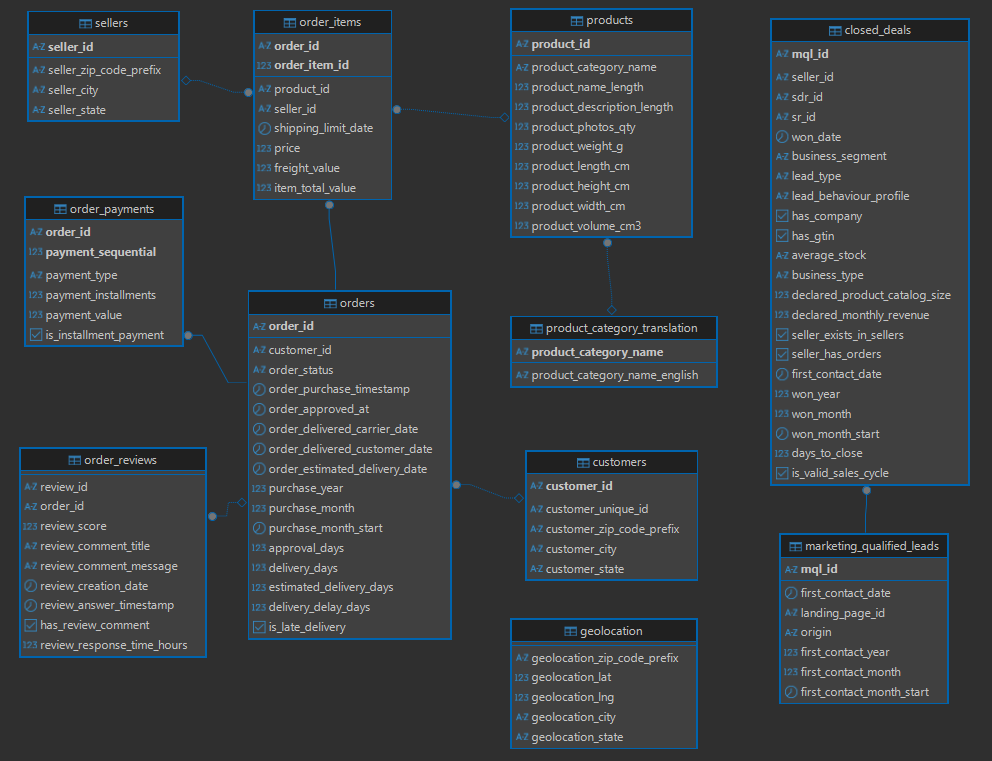

### Analysis Views
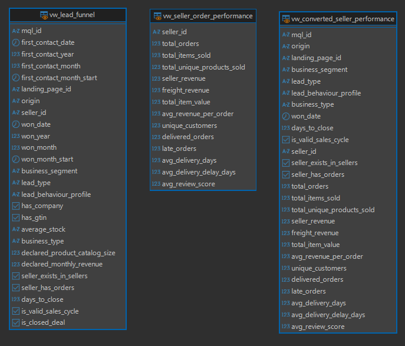

## ❓ 5. Business Questions & Insights
### Q1: Which marketing channels generate the best business value?

<p align="center">
  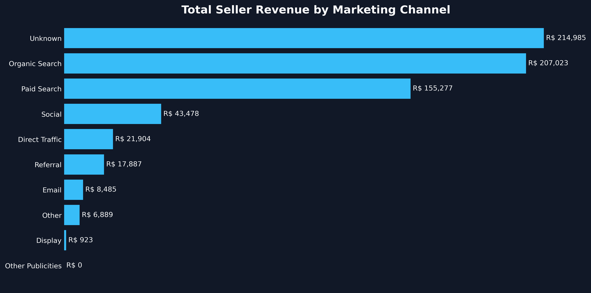
  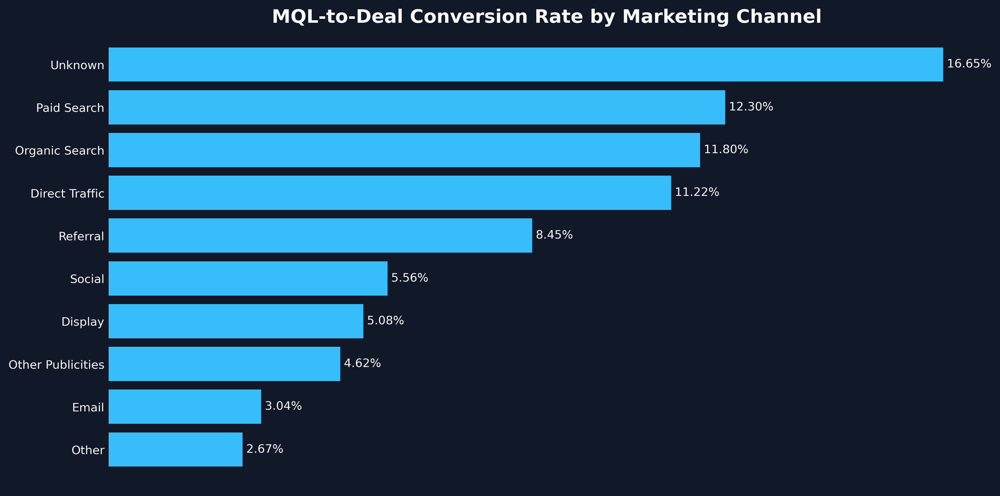
</p>

* **Top Revenue Drivers:** 
    * **Organic Search** is the leading identifiable source with **R$ 207k** in revenue, followed by **Paid Search** at **R$ 155k**.
* **Conversion Efficiency:** 
    * **Paid Search** achieves the highest conversion rate (**12.3%**) among known channels, indicating high lead quality.
* **Tracking Gap:** 
    * The **"Unknown"** category accounts for the highest revenue (R$ 215k) and conversion (16.7%), highlighting a critical need for better attribution.
* **Optimization Opportunity:** 
    * **Direct Traffic** is the fastest primary channel to close (**31 days**). Conversely, **Display** and **Other Publicities** generate negligible revenue, suggesting a budget reallocation toward high-converting **Search** channels.

### Q2: Which landing pages attract the highest-quality leads?

<p align="center">
  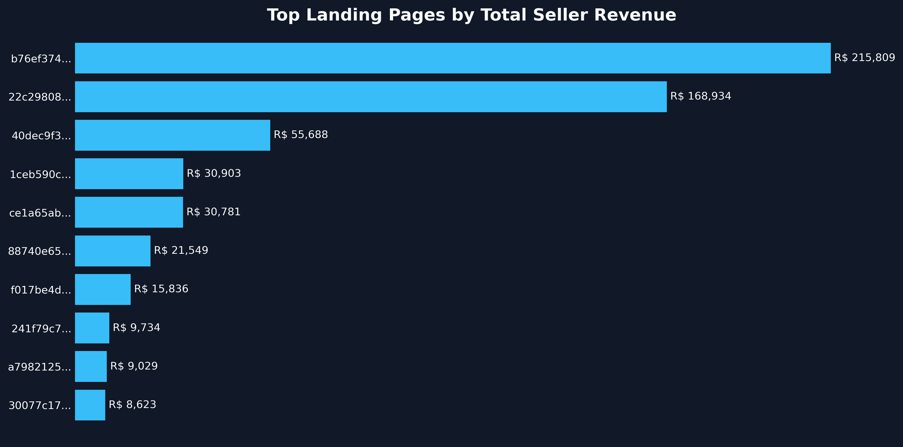
  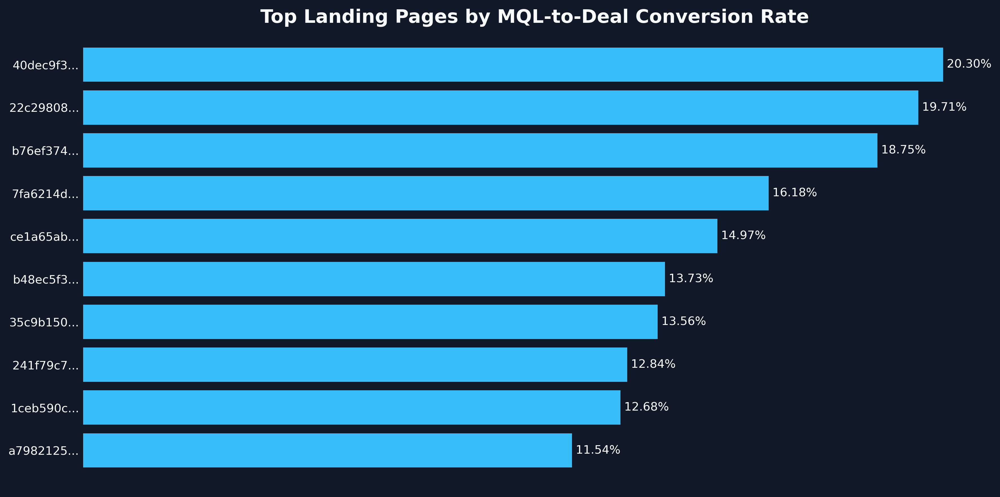
</p>

* **Revenue Powerhouses:** 
    * Pages `b76ef...` and `22c29...` are the primary value drivers, contributing over **R$ 384k** in combined revenue while maintaining strong conversion rates (~19%).
* **Efficiency Leader:** 
    * Page `40dec...` offers the best balance of quality and speed, featuring the highest conversion rate among high-volume pages (**20.3%**) and a fast **35-day** sales cycle.
* **High-Ticket Quality:** 
    * Page `1ceb5...` attracts premium leads with a **Revenue per Deal of R$ 3,433**—over 3x the average—though these deals require a longer sales cycle (**70 days**).
* **Volume vs. Quality:** 
    * High-traffic page `58326...` (495 MQLs) converts at only **5.45%**, demonstrating that high lead volume on specific pages does not necessarily translate to high-quality business outcomes.

### Q3: Which lead profiles should the sales team prioritize?

<p align="center">
  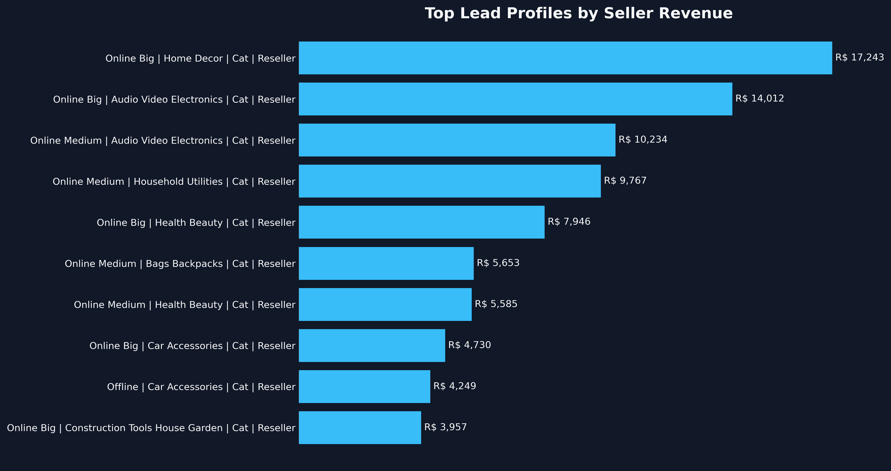
</p>

* **Revenue Drivers:** 
    * Focus on **Online (Big/Medium) Resellers** with a **"Cat"** behavior profile, as they represent the highest concentration of total revenue across all analyzed segments.
* **Top Segments:** 
    * **Home Decor** and **Audio/Video Electronics** are the highest-value industries; Home Decor specifically shows a **100% deal-to-active conversion rate** for its top profile.
* **Closing Speed:** 
    * Leads in **Construction Tools** and **Health & Beauty** close the fastest (averaging **9–23 days**), providing the highest operational velocity for the sales team.
* **Quality Lead Type:** 
    * **Resellers** consistently outperform Manufacturers in both total revenue volume and the rate of conversion to active seller status.

### Q4: How efficient is the sales process?

<p align="center">
  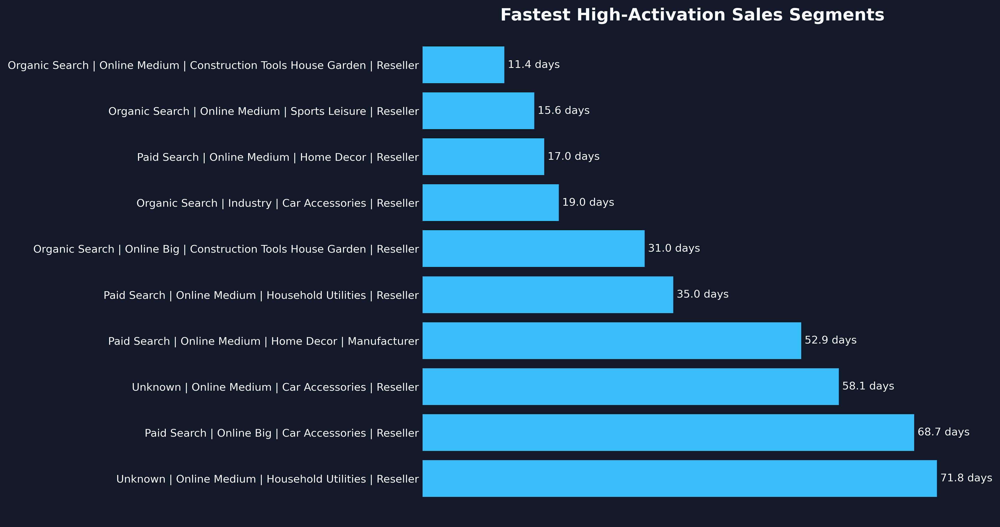
  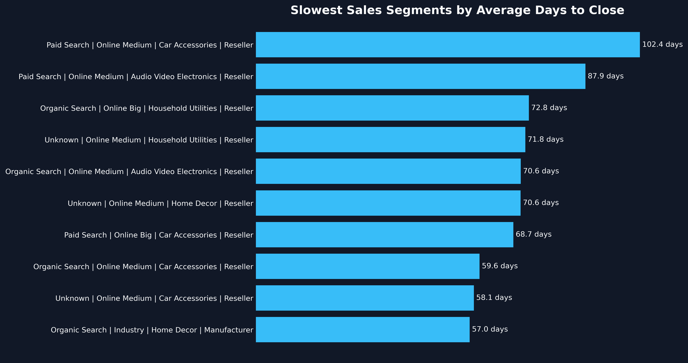
</p>

* **High-Velocity Segments:** 
    * **Organic Search** leads in efficiency for **Construction Tools** and **Sports & Leisure**, achieving sales cycles as short as **11 days** with a high **80% activation rate**.
* **Closing Bottlenecks:** 
    * **Paid Search** encounters significant delays in **Car Accessories** and **Electronics**, with cycles exceeding **87 days** and notably lower seller activation rates (<30%).
* **Efficiency vs. Activation:** 
    * There is a clear correlation between speed and quality; segments closing under **20 days** maintain an **80% deal-to-active seller rate**, whereas the slowest segments drop to 20%.
* **Channel Specificity:** 
    * **Paid Search** is highly efficient for **Home Decor** (17 days) but underperforms in technical categories, suggesting a need to refine lead nurturing or reallocate budget to **Organic** channels for those niches.

### Q5: Do converted sellers become active marketplace sellers?

<p align="center">
  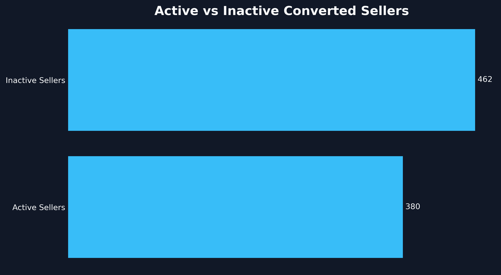
  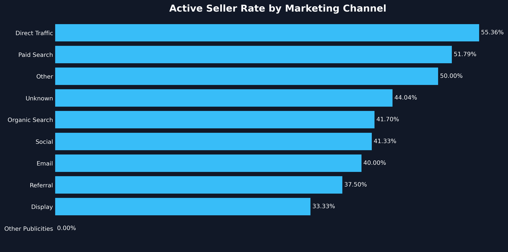
</p>

* **Activation Gap:** 
    * Only **45.13%** of converted leads successfully transition to active marketplace sellers, resulting in **462 inactive** vs. **380 active** sellers.
* **Channel Performance:** 
    * **Direct Traffic** (**55.36%**) and **Paid Search** (**51.79%**) are the most efficient channels for acquiring leads that successfully transition to active selling.
* **Revenue Contribution:** 
    * Despite the high volume of inactive sellers, the active group is highly productive, generating **R$ 676,851** in total revenue with an average of **11.89 orders** per seller.
* **Quality Standard:** 
    * Converted active sellers maintain a healthy performance level, achieving a strong average review score of **4.3**.

### Q6: Which converted seller groups create the strongest marketplace outcomes?

<p align="center">
  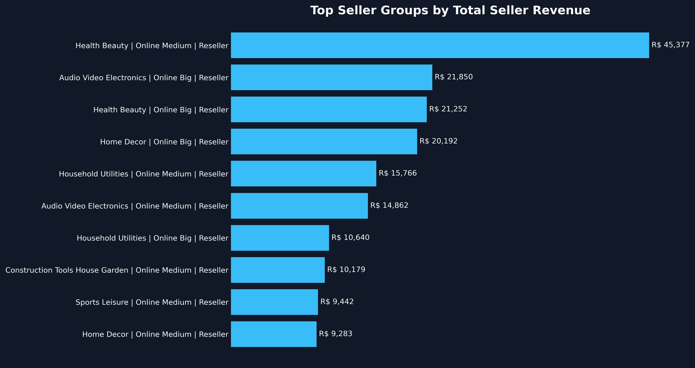
  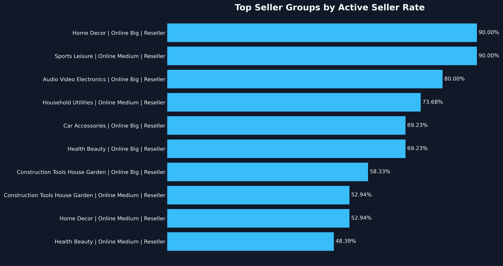
</p>

* **Revenue Titan:** 
    * The **Health & Beauty | Online Medium | Reseller** group is the primary value driver, generating **R$ 45,377** in total revenue with a high volume of **25 orders per active seller**.
* **Activation Excellence:** 
    * **Home Decor (Online Big)** and **Sports & Leisure (Online Medium)** resellers lead in marketplace integration, achieving a **90% active seller rate**.
* **Operational Gold Standard:** 
    * **Household Utilities Manufacturers** (Online Medium) represent the highest quality leads, maintaining a **0% late delivery rate** and a top-tier average review score of **4.78**.
* **High-Ticket Efficiency:** 
    * **Audio/Video Electronics (Online Big)** resellers command the highest average revenue per active seller (**R$ 2,731**), signaling a lucrative segment for high-value marketplace growth.

## 💡 6. Recommendations

* **Fix Attribution Tracking:** 
    * Resolve tracking gaps for the "Unknown" marketing channel immediately. It currently masks the true acquisition source of **R$ 215k** in generated revenue.
* **Reallocate Marketing Spend:** 
    * Shift advertising budget away from Display and "Other Publicities" (negligible ROI) toward high-performing **Organic** and **Paid Search** channels.
* **Optimize Sales Prioritization:** 
    * Direct the sales team to prioritize **"Cat" profile Online Resellers** in **Home Decor** and **Health & Beauty** to maximize revenue volume and operational velocity.
* **Implement Seller Onboarding:** 
    * Address the massive **54.87% post-conversion drop-off** by launching a targeted onboarding and activation program to help closed leads list their first products.
* **Audit Landing Pages:** 
    * Route paid traffic to high-efficiency pages (like `40dec...` and `b76ef...`) and audit high-traffic, low-converting pages (like `58326...`) for UX friction or intent mismatch.

## 📂 7. Project Structure
```text
├── Assets/
│   ├── Data_Model/               # ER diagrams
│   └── Visuals/                  # Exported chart images
├── Dataset/
│   ├── Analysis_Results/         # CSVs exported from SQL queries
│   ├── Processed/                # Cleaned CSVs ready for DB load
│   └── Raw/                      # Original Kaggle datasets
├── Python/
│   ├── 01_inspection_cleaning.ipynb         # Data ETL and cleaning
│   └── 02_sql_insights_visualization.ipynb  # Matplotlib chart generation
├── SQL/
│   ├── Analysis/                 # Queries answering the 6 business questions
│   └── Setup/                    # DB schema, data loading, indexing, and views
└── README.md
```

## 💻 8. How to Reproduce
> **Note:** To maintain repository efficiency, no `.csv` files are uploaded to GitHub. You must download the raw datasets and generate the processed/result files locally by following the steps below.

1. **Download Raw Data:** Visit the [Olist Kaggle Organization Page](https://www.kaggle.com/organizations/olistbr) and download the "Brazilian E-Commerce Public Dataset" and the "Marketing Funnel Dataset" into your `Dataset/Raw/` folder.
2. **Generate Processed Data:** Run the `Python/01_inspection_cleaning.ipynb` notebook. This will clean the raw data and generate the standardized CSV files required for the database in `Dataset/Processed/`.
3. **Setup Database:** Execute the SQL scripts in the `SQL/Setup/` folder in numerical order (01 to 05) using PostgreSQL. This will create the schema, load your newly generated processed CSVs, build indexes, and create the analytical views.
4. **Generate Analysis Results:** Run the queries in the `SQL/Analysis/` folder. To ensure the visualization notebook works, export these query results as CSVs into `Dataset/Analysis_Results/`.
5. **Generate Visuals:** Run `Python/02_sql_insights_visualization.ipynb` to recreate the executive dashboard charts based on your local analysis results.